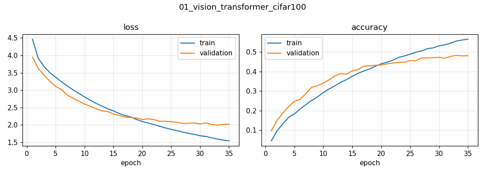

# 01 · Vision Transformer (ViT) from Scratch on CIFAR-100

Can a model with **no convolutions at all** classify images? A Vision Transformer cuts an image into patches, treats each patch like a word, and runs a standard Transformer encoder over them.

## Approach
| | |
|---|---|
| Data | CIFAR-100 — 50,000 train (10 % held out for validation) / 10,000 test images, 100 classes |
| Patching | images up-scaled 32→72 px, cut into 6×6 patches → **144 tokens** of 108 values each |
| Model | patch projection + learned position embeddings → **8 pre-norm Transformer blocks** (4 heads, dim 64, GELU MLP) → MLP head · 21.8 M parameters |
| Augmentation | normalization, random flip, rotation, zoom — inside the model, on the GPU |
| Training | AdamW (lr 1e-3, wd 1e-4), batch 256, **trained from scratch** (no pre-training), 40-minute budget |
| Hardware | NVIDIA T4 · 35 epochs · 40.5 min |

```
image → patches → linear projection + position embedding → [LayerNorm → Multi-Head Self-Attention → +]
                                                         → [LayerNorm → MLP → +]  × 8 → head → 100 classes
```

## Results (10,000 test images)
| Metric | Value |
|---|---|
| Top-1 accuracy | **48.8 %** |
| Top-5 accuracy | **77.0 %** |

The Keras reference implementation reports ~55 % top-1 after **100** epochs; this run reached 48.8 % in 35 epochs (time-capped) and was still improving.



## Discussion points
- **Why only ~50 % when CNNs get 70 %+ on CIFAR-100?** Transformers lack the *inductive biases* of convolutions (locality, translation equivariance) and must learn them from data. With only 50k small images, they under-perform — ViTs shine after pre-training on huge datasets (the original paper used JFT-300M). This is the key trade-off to discuss.
- **Global receptive field from layer 1:** every patch attends to every other patch immediately; a CNN needs many layers to connect distant pixels.
- **Fixes on small data:** stronger augmentation (RandAugment, Mixup/CutMix), DeiT-style distillation from a CNN teacher, smaller patches, hybrid conv-stem, or start from a pre-trained ViT and fine-tune. [Project 02 (ShiftViT)](../02_shiftvit_cifar10) shows a hierarchical design that works better on small images.
- **Cost:** attention is O(n²) in the number of patches — 144 tokens here; halving the patch size would mean 4× the tokens and ~16× the attention cost.

## Run
```bash
python 01_vision_transformer_cifar100/train.py                 # 40-min budget
TIME_LIMIT_MIN=120 EPOCHS=100 python 01_vision_transformer_cifar100/train.py
```
Adapted from the Keras example by Khalid Salama (Apache-2.0).
