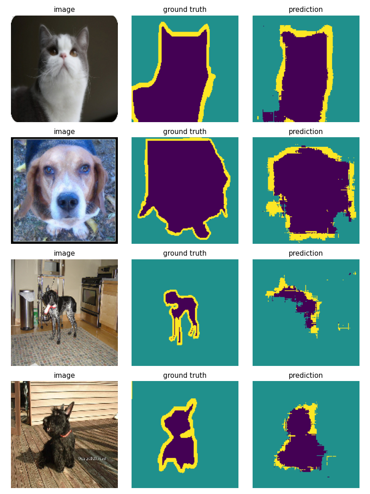
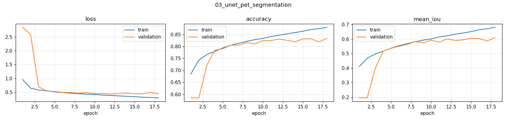

# 03 · Semantic Segmentation with a U-Net (Oxford-IIIT Pets)

Pixel-level segmentation: for every pixel of a pet photo, predict **pet**, **background** or **outline**.

## Approach
| | |
|---|---|
| Data | Oxford-IIIT Pet — 7,390 images with trimap masks · 6,335 train / 1,055 validation |
| Model | U-Net-style encoder–decoder with Xception-style **separable convolutions** and **residual connections** (2.06 M parameters) |
| Input | 160 × 160 RGB |
| Loss | Per-pixel sparse categorical cross-entropy |
| Training | Adam (1e-4), batch 32, early stopping on validation loss |
| Hardware | NVIDIA T4 (Google Colab) · 11.6 min |

**Encoder** (160→10 px) learns *what* is in the image; **decoder** (10→160 px, transposed convs + up-sampling) recovers *where*. Separable convolutions (depthwise + pointwise) keep the parameter count ~8× lower than standard convs.

## Results (validation set)
| Metric | Value |
|---|---|
| Pixel accuracy | **83.0 %** |
| Mean IoU (3 classes) | **0.601** |
| Epochs (early-stopped) | 18 |




## Discussion points
- **Why mIoU and not accuracy?** Classes are imbalanced (the thin outline class covers few pixels), so a model can score high pixel accuracy while missing it entirely. Per-class IoU exposes that.
- **Nearest-neighbour resizing for masks** — bilinear would create invalid labels (e.g. 1.5).
- **Failure mode:** thin structures (legs, ears) and cluttered scenes (3rd example). Next steps: skip connections at *every* resolution (classic U-Net concatenation), a pretrained encoder (e.g. EfficientNet), Dice loss for the thin outline class.

## Run
```bash
python 03_unet_pet_segmentation/train.py          # ~12 min on a T4
QUICK=1 python 03_unet_pet_segmentation/train.py  # 2-minute smoke test
```
Adapted from the Keras example by François Chollet (Apache-2.0). Dataset: Parkhi et al., 2012 (CC BY-SA 4.0).
