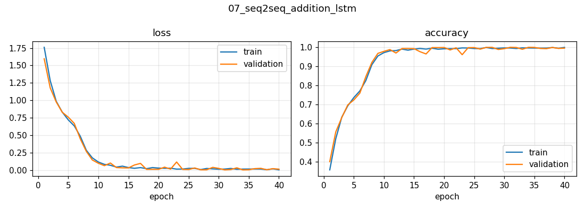

# 07 · Teaching an LSTM to Add — Sequence-to-Sequence Learning

Input the *string* `"535+61"`, output the *string* `"596"`. The network is never told what "+" means; it learns addition — including carrying — from 50,000 examples.

## Approach
| | |
|---|---|
| Data | 50,000 unique random problems `a+b`, a, b ≤ 999 · 90/10 split |
| Encoding | One-hot characters from a 12-symbol alphabet `0-9 + space` |
| Model | Encoder LSTM(128) → RepeatVector(4) → decoder LSTM(128) → per-step softmax (205k parameters) |
| Trick | **Input reversed** (`"16+535"`) — Zaremba & Sutskever, 2014 |
| Training | Adam, batch 32, 40 epochs · NVIDIA T4 · 7.2 min |

## Results (5,000 held-out problems)
| Metric | Value |
|---|---|
| Character accuracy | 99.5 % |
| **Exact-match accuracy** (every digit right) | **98.1 %** |

| question | true | predicted |
|---|---|---|
| 926+665 | 1591 | 1591 ✓ |
| 543+608 | 1151 | 1151 ✓ |
| 236+768 | 1004 | 1004 ✓ |
| 930+910 | 1840 | 1840 ✓ |



## Discussion points
- **Report exact match, not just character accuracy:** 99.5 % per character still means some answers have one wrong digit. For arithmetic only exact match counts.
- **Why reversing helps:** addition works right-to-left; reversing puts the least-significant digits (which decide the carries) closest to the output, shortening the dependency path the LSTM must remember.
- **The bottleneck:** the whole question is squeezed into one 128-d vector — the limitation that motivated **attention** (Bahdanau et al., 2014) and ultimately Transformers.

## Run
```bash
python 07_seq2seq_addition_lstm/train.py   # ~7 min on a T4
```
Adapted from the Keras example (Apache-2.0).
