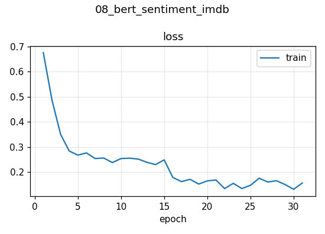

# 08 · Fine-tuning BERT for Sentiment Analysis (IMDB) — with a Measured Baseline

Classify movie reviews as positive or negative, and **measure** what a pretrained Transformer adds over a strong classical baseline.

## Approach
| | |
|---|---|
| Data | IMDB — 25,000 train / 25,000 test reviews, balanced |
| Baseline | TF-IDF (uni+bi-grams, 50k features) + logistic regression |
| Model | `bert-base-uncased` (110 M parameters) + linear head on `[CLS]` |
| Fine-tuning | Full network, 2 epochs, LR 2e-5, 6 % warm-up + linear decay, weight decay 0.01 |
| Efficiency | bf16 mixed precision, dynamic padding, max 256 tokens |
| Stack | PyTorch + Hugging Face `transformers` / `datasets`, scikit-learn |
| Hardware | NVIDIA L4 · 7.4 min |

## Results (full 25,000-review test set)
| Model | Accuracy | F1 |
|---|---|---|
| TF-IDF + logistic regression | 90.4 % | 0.904 |
| **BERT fine-tuned** | **92.4 %** | **0.925** |

BERT removes **~21 % of the baseline's errors** (9.6 % → 7.6 % error rate).

### Predictions on new, hand-written reviews
| review | P(positive) |
|---|---|
| An absolute masterpiece, I was moved to tears. | 0.991 ✓ |
| Two hours of my life I will never get back. | **0.826 ✗** |
| The acting was fine but the plot made no sense at all. | 0.006 ✓ |
| Not bad at all - better than I expected! | 0.908 ✓ |

The second one is an honest failure: an **idiom with no negative words**. Great interview material — see below.



## Discussion points
- **Always build a baseline.** TF-IDF + LR is surprisingly strong on long reviews (90 %); the Transformer's value is the last few points and robustness to negation ("not bad" ✓).
- **Error analysis:** idioms/sarcasm ("never get back") need world knowledge; fixes: more epochs, larger/instruction-tuned models, domain data augmentation.
- **Truncation at 256 tokens** drops the end of long reviews, where the verdict often is. Head+tail truncation is a known cheap improvement.
- **Production:** distillation (DistilBERT), ONNX Runtime + int8 quantization for latency.

## Run
```bash
python 08_bert_sentiment_imdb/train.py   # ~10 min on an L4
```
