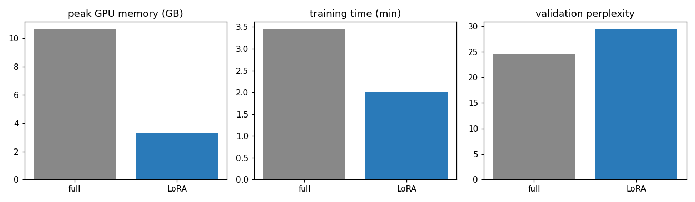

# 09 · Parameter-efficient Fine-tuning: GPT-2 with LoRA vs. Full Fine-tuning

Do we need to update all 124 M weights of a language model to adapt it to a new kind of text? Same data, same settings, two runs — full fine-tuning and **LoRA** — and every cost measured.

## Approach
| | |
|---|---|
| Model | GPT-2 base (124 M) via KerasHub, mixed precision (float16) |
| Data | Reddit TIFU stories — 16,000 training texts, 1,600 held-out, 128 tokens |
| LoRA | `backbone.enable_lora(rank=4)`: frozen weights **W**, trainable low-rank update **B·A** (r = 4) on the attention projections; LR scaled by α/r = 8 to match the paper's scaling |
| Training | 1 epoch, AdamW (lr 5e-5 full / 4e-4 LoRA), weight decay 0.01, grad-clip 1.0 |
| Isolation | each mode runs in its own process, so GPU-memory peaks are not mixed |

```
output = W·x + (α/r)·B·A·x      W frozen · A: d×r · B: r×k · B initialised to 0 → training starts from GPT-2 exactly
```

## Results (held-out perplexity; lower is better)
| Metric | Full fine-tuning | **LoRA (r = 4)** |
|---|---|---|
| Trainable parameters | 124,439,808 (100 %) | **909,312 (0.73 %)** |
| Peak GPU memory | 10.66 GB | **3.29 GB (−69 %)** |
| Training time | 3.45 min | **2.00 min (−42 %)** |
| Validation perplexity (GPT-2 before: 41.1) | **24.6** | 29.4 |



**LoRA recovered 70 % of full fine-tuning's perplexity improvement (41.1 → 29.4 vs. 41.1 → 24.6) while training 0.73 % of the parameters with 69 % less GPU memory.**

Sample generation (LoRA): *"Today I messed up by accidentally touching the wrong side of a toilet…"* — the model has picked up the TIFU storytelling style. More in [`comparison.md`](../results/09_gpt2_lora_finetuning/comparison.md).

## Discussion points
- **Where the memory goes:** full fine-tuning stores gradients and two Adam moments for all 124 M weights; LoRA only for 0.9 M. At 7B+ scale this is the difference between one GPU and a cluster — see QLoRA in [llm-engineering-projects](https://github.com/kishorhange111/llm-engineering-projects/tree/main/02_qlora_text_to_sql).
- **The quality gap is real at r = 4 and one epoch.** Options: higher rank, LoRA on all projections (MLP too), longer training — or accept the gap for the ~100× cheaper adapter storage (one base model + many small task adapters).
- **Zero inference latency:** after training, B·A can be merged into W.
- **Why scale the LR by α/r?** Keras' `enable_lora` omits the α/r output scaling of the paper; with Adam, scaling the LoRA output ≈ scaling its learning rate.

## Run
```bash
pip install keras-hub datasets
python 09_gpt2_lora_finetuning/train.py        # runs both modes, ~10 min on an L4
```
Adapted from the Keras example by Abheesht Sharma & Matthew Watson (Apache-2.0). Data: Reddit TIFU (Kim et al., 2019).
