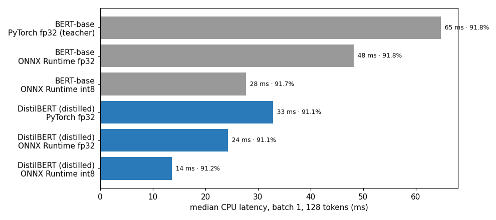

# 10 · Making BERT 4.8× Faster: Knowledge Distillation + ONNX Runtime + int8 Quantization

A fine-tuned BERT is accurate but slow and large. This project walks the full production optimization ladder and **measures every step** — latency, size and accuracy — instead of assuming the gains.

## The ladder
| Step | What it does |
|---|---|
| **Teacher** | `bert-base-uncased` (12 layers, 110 M) fine-tuned on IMDB sentiment |
| **Knowledge distillation** | `distilbert-base-uncased` (6 layers, 66 M) trained on `0.5·CE(labels) + 0.5·T²·KL(teacher ‖ student)` at temperature T = 2 — it learns from the teacher's *soft* probabilities, not only hard labels. A student trained on labels only is the control. |
| **ONNX export** | framework-independent graph; ONNX Runtime fuses attention / LayerNorm / GELU operators |
| **Dynamic int8 quantization** | weights stored as 8-bit integers, activations quantized on the fly — no calibration data needed |

Training: 25k IMDB reviews, 2 epochs each, bf16 on an A100 (teacher 1.8 min, each student 1.1 min).
Benchmark: **CPU**, batch 1, 128 tokens (a typical online request), median of 200 runs after warm-up; accuracy on 2,000 test reviews for every variant.

## Results
| Variant | p50 latency | p95 | Size | Accuracy | Speed-up |
|---|---|---|---|---|---|
| BERT-base · PyTorch fp32 (teacher) | 64.8 ms | 159.0 ms | 418 MB | 91.8 % | 1.0× |
| BERT-base · ONNX Runtime fp32 | 48.2 ms | 108.9 ms | 418 MB | 91.8 % | 1.3× |
| BERT-base · ONNX Runtime int8 | 27.7 ms | 57.8 ms | 105 MB | 91.7 % | 2.3× |
| DistilBERT (distilled) · PyTorch fp32 | 32.9 ms | 71.7 ms | 255 MB | 91.1 % | 2.0× |
| DistilBERT (distilled) · ONNX Runtime fp32 | 24.3 ms | 59.5 ms | 256 MB | 91.1 % | 2.7× |
| **DistilBERT (distilled) · ONNX Runtime int8** | **13.6 ms** | **15.0 ms** | **64 MB** | **91.2 %** | **4.8×** |

**End result: 79 % lower median latency, 91 % lower p95 latency, 85 % smaller, −0.6 points accuracy.**



Full 25k test set (GPU): teacher 92.26 % · DistilBERT on labels only 91.43 % · DistilBERT with distillation 91.49 %.

## Discussion points
- **Each step compounds:** ONNX Runtime alone 1.3×, int8 alone 2.3×, a smaller architecture 2.0× — together 4.8×. The **p95 tail** improves most (159 → 15 ms), which is what users feel under load.
- **Distillation gain here is small (+0.06 pts over label-only training)** — honest result: on a large, clean dataset like IMDB the hard labels already carry most of the signal. Distillation pays off more with little labelled data, noisy labels, or when the teacher is much stronger than the student.
- **int8 barely hurt accuracy** (91.8 → 91.7 % for BERT). A tiny smoke-test run showed a big int8 drop on an *under-trained* model — quantization is more fragile when the model hasn't converged, another reason to measure every time.
- **Why dynamic (not static) quantization?** Transformer activations vary a lot per input; dynamic quantization needs no calibration set and is the standard for BERT-style models on CPU.
- **Next steps:** static quantization with calibration, pruning attention heads, sequence-length bucketing, and serving with batching (Triton / ONNX Runtime server) to raise throughput rather than just single-request latency.

## Run
```bash
pip install torch transformers datasets onnx onnxruntime onnxscript
python 10_bert_distillation_onnx_quantization/train.py
```
