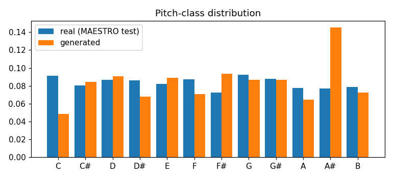

# 13 · Generating Piano Music with a Transformer (MAESTRO, PyTorch)

Music generation as language modelling: expressive piano performances become sequences of events, and a GPT written from scratch learns to continue them.

## Approach
| | |
|---|---|
| Representation | **performance events** (as in Music Transformer): NOTE_ON ×128, NOTE_OFF ×128, TIME_SHIFT ×100 (10 ms – 1 s), VELOCITY ×32 → a 388-token vocabulary that keeps expressive timing and dynamics |
| Tokenizer | written from scratch with `pretty_midi` (no external tokenizer package), parallelised across CPU cores |
| Data | **MAESTRO v3** virtuoso piano performances — official split by piece; 25.5 M training events |
| Model | decoder-only Transformer from scratch: 8 layers, 512-d, 8 heads, 1,024-event context, PyTorch `scaled_dot_product_attention` (Flash kernels) — 26.1 M params |
| Training | AdamW, warm-up, mixed precision, random 1,024-event windows, **35-minute budget on a T4** (1,237 steps × 16 windows) |
| Sampling | nucleus (top-p 0.95) continuation of held-out test openings |

## Results
| Metric | Real (MAESTRO test) | Generated |
|---|---|---|
| **Test perplexity per event** | — | **16.9** (vs. 388 for a uniform guess) |
| Pitch-class similarity (1 − Jensen–Shannon distance) | — | **0.876** |
| Note density | 10.3 notes/s | 11.7 notes/s |
| Mean velocity (loudness) | 65.3 | 67.1 |



The model reproduces the texture of real performances — density and dynamics within ~15 % and 3 % of the real recordings. The pitch-class histogram of only three generated continuations is dominated by the key of their prompts (e.g. the A♯ peak), which is why the similarity is 0.88 rather than ~1.

*Generated MIDI samples are produced by the script (`results/…/sample_*.mid`) but not committed: each begins with a short excerpt of a MAESTRO recording (CC BY-NC-SA 4.0).*

## Discussion points
- **Why events, not a score?** A performance-event vocabulary models *how* a pianist plays (rubato, dynamics), so generated music sounds human rather than quantised.
- **Perplexity 16.9 after 35 T4-minutes** means the model is choosing among ~17 plausible next events instead of 388. Music Transformer reaches lower values with relative position attention, longer context (2k+ events) and days of training.
- **Weaknesses:** long-range structure (themes returning, form) — a 1,024-event window covers ~30–60 s of music. Relative attention, longer context or hierarchical models address this.
- Same recipe as LLMs — tokenise, next-token prediction, sample with top-p — applied to audio-adjacent data.

## Run
```bash
pip install torch pretty_midi matplotlib
python 13_music_transformer_midi/train.py        # downloads MAESTRO MIDI (57 MB), 35-min budget
```
Data: MAESTRO v3 (Hawthorne et al., 2019), Google Magenta, CC BY-NC-SA 4.0.
