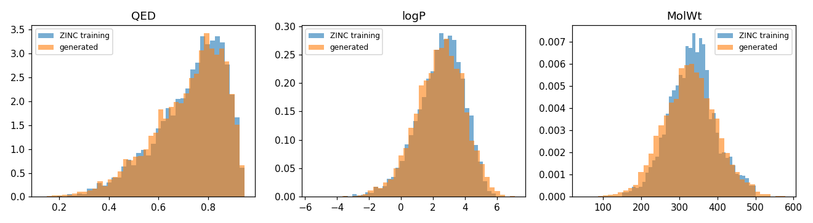
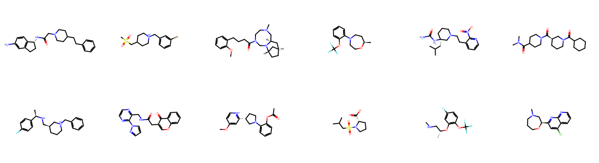

# 14 · Generating Drug-like Molecules with a Transformer (ZINC-250k, PyTorch)

De novo molecular design framed as language modelling: a GPT learns the "grammar" of chemistry from 250k SMILES strings (e.g. aspirin = `CC(=O)Oc1ccccc1C(=O)O`) and writes new molecules one character at a time.

## Why this approach
The Keras reference example generates molecular *graphs* with a WGAN-GP + relational graph network. GANs are hard to train, and graph GANs typically yield few valid, unique molecules. Autoregressive SMILES models are the stronger, simpler baseline in the **GuacaMol / MOSES** benchmarks — so this project implements that, in PyTorch, and evaluates it with the standard metrics.

## Approach
| | |
|---|---|
| Data | ZINC-250k drug-like molecules (249,455 SMILES ≤ 126 characters) |
| Model | decoder-only Transformer written from scratch: 6 layers, 384-d, 6 heads, character tokens with `<bos>`/`<eos>` — 10.7 M parameters |
| Training | AdamW, warm-up, mixed precision, **30-minute budget on a T4** (1,774 steps × 256 molecules) |
| Sampling | 10,000 molecules, temperature 1.0 |
| Evaluation | RDKit: validity, uniqueness, novelty; QED / logP / molecular-weight distributions vs. the training set |

## Results (10,000 generated molecules)
| Metric | Value | Meaning |
|---|---|---|
| **Validity** | **73.4 %** | parse into a real molecule with RDKit |
| **Uniqueness** | **99.99 %** | distinct among the valid ones — no mode collapse |
| **Novelty** | **99.97 %** | not in the training set* |
| QED (drug-likeness) mean | 0.721 generated vs. 0.729 training | |
| logP mean | 2.42 vs. 2.47 | |
| Molecular weight mean | 328 vs. 334 Da | |

The generated molecules reproduce the training distributions of drug-likeness, lipophilicity and size almost exactly:




\* novelty is checked against the training strings; a fully canonical comparison would lower it slightly.

## Discussion points
- **Validity 73 % after 30 T4-minutes** is the model's main weakness: character-level SMILES must balance ring-closure digits and parentheses over long ranges. Published CharRNN/GPT baselines reach 90 %+ with longer training. Fixes: train longer / larger, or switch to **SELFIES**, a representation in which *every* string is a valid molecule (100 % validity by construction).
- **Uniqueness and novelty ≈ 100 %** show the model generalises rather than memorising — the classic failure of generative models (and of many GANs) is mode collapse.
- **Distribution matching ≠ useful drugs.** The next step in real drug discovery is *goal-directed* generation: fine-tune with reinforcement learning (e.g. REINVENT-style) toward a target property such as QED, docking score or synthesisability, with validity and diversity as constraints.
- Same modelling recipe as an LLM — tokenise, next-token prediction, sample — applied to chemistry, which makes it a nice bridge between GenAI and scientific ML.

## Run
```bash
pip install torch rdkit matplotlib
python 14_molecule_generation_gpt/train.py        # 30-minute budget
```
Data: ZINC-250k as released with Gómez-Bombarelli et al., 2018 (Automatic chemical design using a data-driven continuous representation of molecules).
