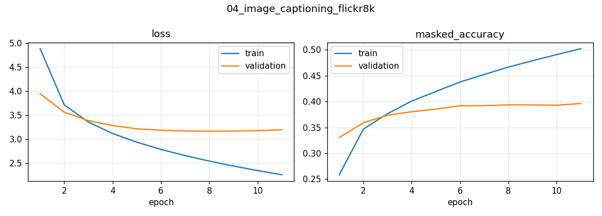

# 04 · Image Captioning — CNN Encoder + Transformer Decoder (Flickr8k)

Generate a natural-language description of a photo — the encoder–decoder pattern behind today's vision-language models.

## Approach
| | |
|---|---|
| Data | Flickr8k — 8,091 images × 5 human captions · official 6k / 1k / 1k split |
| Vision encoder | **EfficientNetB0** (ImageNet, frozen) → 10×10 grid = 100 visual tokens × 1280-d |
| Text model | Transformer encoder (1 block) + Transformer decoder (causal self-attention + **cross-attention** to image tokens) |
| Vocabulary | 10,000 words, max 25 tokens · built from training captions only |
| Training | Teacher forcing, masked cross-entropy (padding ignored), Adam 1e-4, early stopping |
| Inference | Batched greedy decoding |
| Hardware | NVIDIA L4 · 5.3 min training |

**Engineering choice:** because the CNN is frozen, its features are computed **once** and cached, instead of re-running EfficientNet on every image every epoch (~10× faster training).

## Results (1,000 held-out test images)
| Metric | Value |
|---|---|
| BLEU-1 | **0.594** |
| BLEU-2 | 0.408 |
| BLEU-3 | 0.270 |
| BLEU-4 | **0.179** |
| Next-word accuracy (val) | 39.6 % |

For reference, the original *Show, Attend and Tell* paper reports BLEU-1 0.67 / BLEU-4 0.19–0.21 on Flickr8k with a much larger setup.

### Sample test-set captions
| generated | one of the human captions |
|---|---|
| two dogs are playing in the snow | the dogs are in the snow in front of a fence |
| a small black and white dog is swimming in a pool | a brown and white dog swimming towards some in the pool |
| a black dog is running on the sand | a black dog emerges from the water onto the sand holding a white object in its mouth |
| a basketball player in white is playing basketball | a player from the white and green highschool team dribbles down court |
| a man in a black jacket and a black jacket is standing by a city street | a man helps another man tie a red ribbon onto his arm |

Full table: [results/…/sample_captions.md](results/sample_captions.md)



## Discussion points
- **Teacher forcing vs. inference:** training sees the true previous word; inference sees its own guesses → *exposure bias*. Visible in repetitions ("a black jacket and a black jacket").
- **Fixes:** beam search, repetition penalty, scheduled sampling, fine-tuning the CNN, or a pretrained text decoder (the BLIP / LLaVA direction).
- **BLEU limitations:** counts n-gram overlap only; "two dogs play in snow" vs. "the dogs are in the snow" is semantically right but scores low. CIDEr / SPICE / CLIPScore are better captioning metrics.

## Run
```bash
python computer-vision/image-captioning-cnn-transformer/train.py   # ~10 min on an L4 (incl. feature extraction)
```
Adapted from the Keras example by A_K_Nain (Apache-2.0). Dataset: Hodosh et al., 2013 (images not redistributed here).
