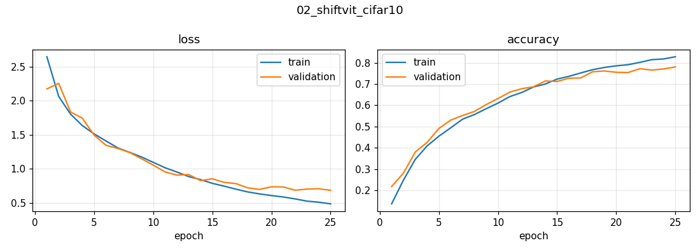

# 02 · ShiftViT: a Vision Transformer *without attention* (CIFAR-10)

Is self-attention really what makes Vision Transformers work? ShiftViT (Wang et al., 2022) replaces every attention layer with a **zero-parameter, zero-FLOP shift operation** and keeps everything else.

## Approach
| | |
|---|---|
| Token mixing | split channels into 12 groups; shift 4 of them by one pixel (left / right / up / down), keep the rest — neighbours' information flows into each position, then a per-pixel MLP mixes it |
| Architecture | patchify (4×4 conv) → **4 hierarchical stages** [2, 4, 8, 2 blocks] with patch merging (resolution ½, channels ×2) — like Swin Transformer · 11.7 M params |
| Regularisation | stochastic depth (DropPath, linearly increasing to 0.2), MLP dropout, random crop + flip |
| Optimisation | AdamW + **warm-up cosine** LR schedule (1e-5 → 1e-3 → 0), early stopping on validation accuracy |
| Data | CIFAR-10: 40k train / 10k validation / 10k test |
| Hardware | NVIDIA T4 · 25 epochs (35-min budget) |

## Results (10,000 test images)
| Metric | Value |
|---|---|
| **Top-1 accuracy** | **77.9 %** |
| Top-5 accuracy | 98.4 % |

The Keras reference implementation reports 76.4 % top-1 after up to 100 epochs; this run beat it in 25.



## Discussion points
- **The headline insight:** on CIFAR-10, a model whose "token mixer" has *no parameters at all* reaches ~78 % in 25 epochs. The **macro-architecture** (hierarchical stages, residual MLP blocks, LayerNorm, stochastic depth, AdamW + warm-up cosine) carries most of the performance; attention is one choice of token mixer among several (see also MLP-Mixer, PoolFormer / "MetaFormer is actually what you need").
- **Why hierarchy helps on small images:** merging patches builds multi-scale features like a CNN, re-introducing locality that plain ViTs must learn from data.
- **Cost:** the shift is a memory copy — no multiply-adds — so compute is dominated by the MLPs.
- **Next:** longer training (100 epochs), RandAugment/Mixup, and comparing against attention and pooling mixers inside the *same* macro-architecture for a controlled ablation.

## Run
```bash
python computer-vision/shiftvit-attention-free-transformer/train.py                     # 40-min default budget
TIME_LIMIT_MIN=120 python computer-vision/shiftvit-attention-free-transformer/train.py
```
Adapted from the Keras example by Aritra Roy Gosthipaty & Ritwik Raha (Apache-2.0), with the shift implemented via padding + slicing.
