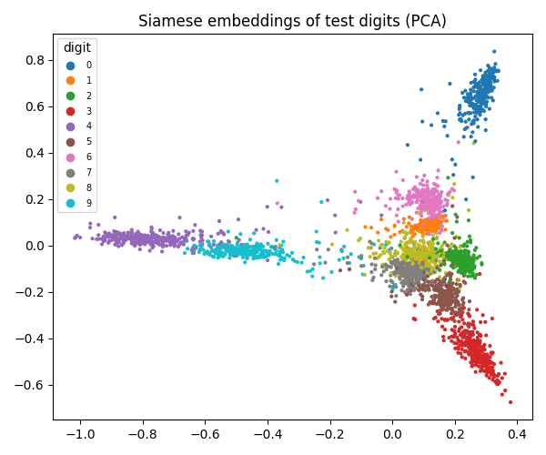
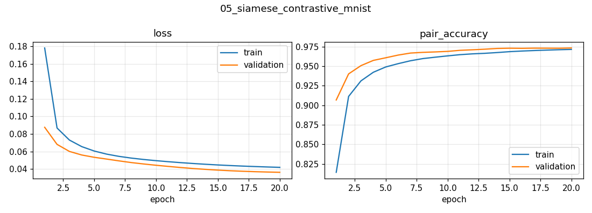

# 05 · Siamese Network with Contrastive Loss (MNIST)

Learn **similarity** instead of classes: given two images, decide whether they show the same digit. The same idea powers face verification, signature checks and one-shot learning.

## Approach
| | |
|---|---|
| Data | MNIST turned into balanced pairs · 100k train / 20k val / 20k test pairs |
| Embedding net | LeNet-style CNN → 10-d vector (**5,318 parameters**) |
| Siamese setup | The same network (shared weights) embeds both images → Euclidean distance |
| Loss | Contrastive loss (Hadsell, Chopra & LeCun, 2006), margin = 1 |
| Decision | distance < 0.5 ⇒ "same digit" |
| Training | RMSprop, batch 64, 20 epochs · NVIDIA T4 · 2.1 min |

```
similar pair    (y=0):  L = d²
dissimilar pair (y=1):  L = max(margin − d, 0)²
```

## Results
| Metric | Value |
|---|---|
| Test pair accuracy | **97.3 %** (Keras reference implementation: 95.8 %) |
| Test contrastive loss | 0.036 |

The model was **never told which digit is which**, yet its embeddings cluster by digit:




## Discussion points
- **Why shared weights?** Guarantees d(a, b) = d(b, a) and that both images live in the same embedding space.
- **Why a margin?** Without it the model could push dissimilar pairs infinitely far apart; with it, "far enough" pairs stop contributing and training focuses on hard ones.
- **Contrastive vs. triplet loss** → see [project 06](../../computer-vision/siamese-network-triplet-loss).
- `sqrt(max(x, ε))` avoids the infinite gradient of √0.

## Run
```bash
python computer-vision/siamese-network-contrastive-loss/train.py   # ~2 min on a T4
```
Adapted from the Keras example by Mehdi (Apache-2.0).
