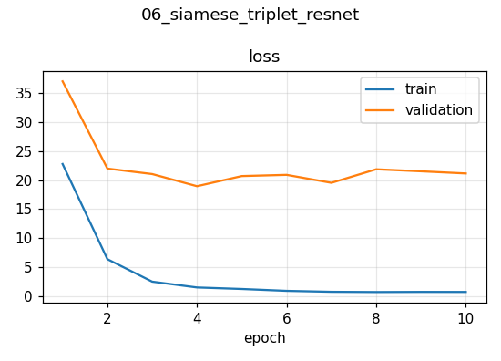

# 06 · Image Similarity with Triplet Loss and a Fine-tuned ResNet50

Learn an embedding space where images humans consider look-alikes are close together — the core of image search, "more like this" recommendations and face recognition (FaceNet).

## Approach
| | |
|---|---|
| Data | *Totally Looks Like* (Rosenfeld et al., 2018) — ~6k human-judged look-alike pairs · 80/20 split |
| Triplets | anchor = left image, positive = its look-alike, negative = random image |
| Embedding net | **ResNet50** (ImageNet) + Dense 512 → 256 → 256-d embedding |
| Transfer learning | Everything frozen except the last residual stage (`conv5`) and the new head |
| Loss | Triplet loss `max(d(A,P) − d(A,N) + 0.5, 0)` with squared Euclidean distance |
| Training | Custom `train_step` (GradientTape), Adam 1e-4, 10 epochs · NVIDIA L4 · 5.0 min |

## Results (held-out triplets, measured before and after fine-tuning)
| Metric | ImageNet features only | After fine-tuning |
|---|---|---|
| Triplet accuracy — d(A,P) < d(A,N) | 63.4 % | **83.5 %** |
| Mean cosine similarity anchor–positive | 0.621 | 0.363 |
| Mean cosine similarity anchor–negative | 0.580 | **0.016** |
| Gap (positive − negative) | 0.04 | **0.35** |

Before fine-tuning, all embeddings were bunched together (every pair ~0.6 similar). Training spread the space out: unrelated images became nearly orthogonal while look-alikes stayed comparatively close — a ~9× larger separation.



## Discussion points
- **Triplet vs. contrastive loss:** triplet loss only constrains *relative* distances ("P closer than N"), which is exactly what ranking/search needs; contrastive loss (project 05) needs absolute distance targets.
- **Why freeze early layers?** Edges and textures transfer across tasks; fine-tuning only `conv5` + head needs far less data and avoids destroying pretrained features.
- **Next steps:** hard-negative mining (random negatives get easy quickly), L2-normalised embeddings + cosine distance, recall@k evaluation with a vector index (FAISS).

## Run
```bash
pip install gdown
python computer-vision/siamese-network-triplet-loss/train.py   # ~6 min on an L4
```
Adapted from the Keras example by Hazem Essam & Santiago L. Valdarrama (Apache-2.0).
