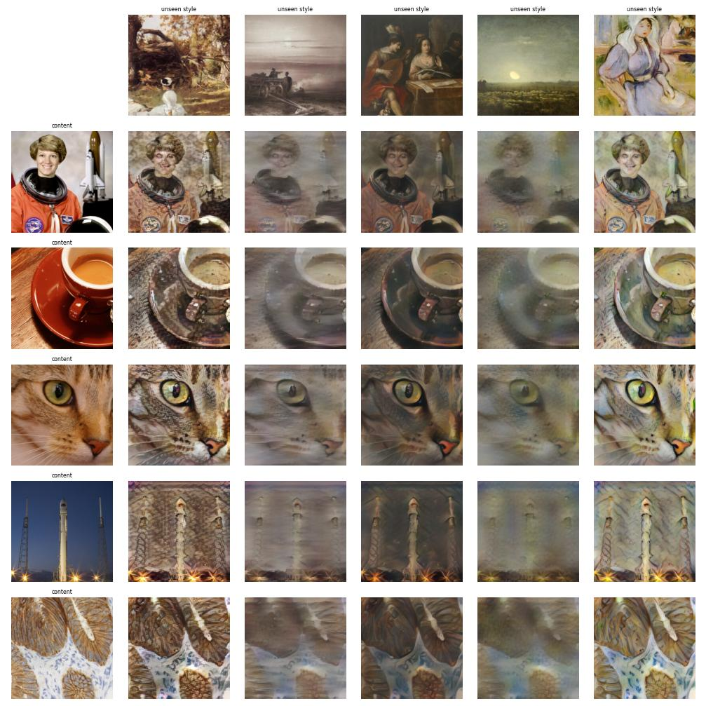
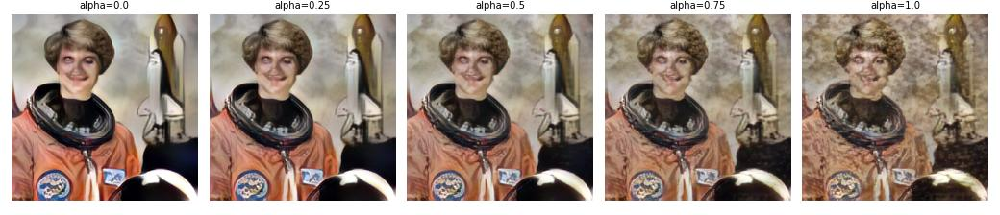

# 12 · Real-time Arbitrary Style Transfer with AdaIN (PyTorch)

Classic neural style transfer optimises each image for hundreds of steps; feed-forward methods need one network per style. **AdaIN** (Huang & Belongie, 2017) handles **any style — including paintings never seen in training — in a single forward pass**.

## The idea
```
AdaIN(x, y) = σ(y) · (x − μ(x)) / σ(x) + μ(y)
```
Encode content and style with a frozen VGG-19 (up to relu4_1); give the content features the per-channel **mean and standard deviation of the style features** (channel statistics carry "style", spatial layout carries content); a learned decoder turns the result back into an image. Only the decoder (3.5 M params) is trained, with a content loss against the AdaIN target and a style loss matching μ/σ at relu1_1…relu4_1.

## Setup
| | |
|---|---|
| Content images | 9,000 photos (Flickr30k, training only) |
| Style images | 6,000 paintings (WikiArt, all movements) |
| Held-out test | 16 **public-domain paintings never used in training** × public-domain photos (scikit-image samples) |
| Training | Adam 1e-4 with inverse-time decay, bf16, batch 8 random 256² crops, style weight 10, **35-minute budget → 19,603 iterations** on one L4 |
| PyTorch rewrite | encoder/decoder, losses and training loop written from scratch (the Keras example was the reference, not the code) |

## Results
**Unseen styles × unseen photos** (rows: content, columns: style):



**User-controllable style strength** — blend content and stylised features with α ∈ [0, 1] at inference:



| Metric | Value |
|---|---|
| Speed | **31 ms per 512×512 image** (one forward pass, L4) |
| Held-out content loss / style loss | 6.13 / 0.66 |
| Trainable parameters | 3.5 M (decoder only) |

Optimisation-based style transfer ([project 11](../../generative-models/neural-style-transfer)) runs hundreds of L-BFGS steps per image; AdaIN trades a little fidelity for **single-pass, arbitrary-style** inference in milliseconds — what makes real-time style filters possible.

## Discussion points
- **Why mean and variance are "style":** Gram-matrix style losses (Gatys) and matching first/second-order channel statistics are closely related; AdaIN makes that alignment an explicit, parameter-free layer.
- **Known artefacts:** washed-out colours with low-contrast styles (column 4), repetitive textures on flat regions (the rocket's sky). Fixes: whitening-colouring transforms (WCT), attention-based transfer (SANet), or higher style weights per layer.
- **Engineering:** content crops are random 256² patches; nearest-neighbour upsampling + reflection padding in the decoder avoid checkerboard artefacts; held-out styles are restricted to pre-1900 (public-domain) movements so published figures carry no copyright issues.

## Run
```bash
pip install torch torchvision datasets scikit-image matplotlib
python generative-models/adain-style-transfer/train.py        # 35-min budget on an L4
```
