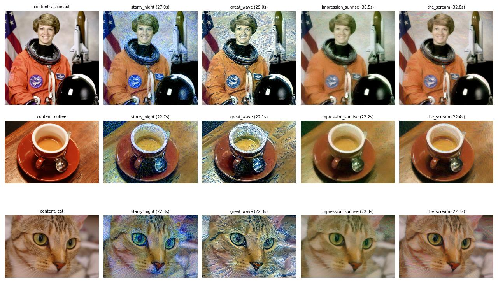
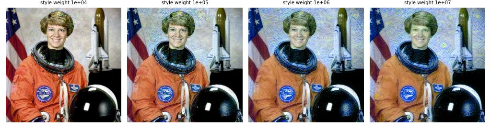

# Neural Style Transfer (Gatys et al.) in PyTorch

Repaint a photo in the style of a painting by **optimising the pixels themselves** against a pretrained VGG-19 — the original 2015 method that started the field.

## The idea
A pretrained CNN separates *what* is in an image from *how* it is painted:
- **Content** = feature maps of a deep layer (`conv4_2`) — which objects are where.
- **Style** = **Gram matrices** (channel-by-channel correlations) of `conv1_1 … conv5_1` — which colours, strokes and textures co-occur, regardless of position.

Start from the photo and minimise `content_loss + w_style · style_loss + w_tv · total_variation` with respect to the image pixels.

## Improvements over the Keras reference example
| | |
|---|---|
| Optimiser | **L-BFGS** (quasi-Newton, strong-Wolfe line search) — converges in 300 steps instead of thousands of SGD steps |
| Regularisation | total-variation loss to suppress high-frequency noise |
| Evaluation | 3 photos × 4 paintings + a content-vs-style weight sweep, with per-image timings |
| Rewrite | PyTorch from scratch (feature extractor, Gram matrices, losses) |

Content photos: scikit-image sample images (public domain / CC0). Styles: public-domain paintings from Wikimedia Commons — *The Starry Night* (van Gogh), *The Great Wave* (Hokusai), *Impression, Sunrise* (Monet), *The Scream* (Munch).

## Results (512 px, 300 L-BFGS steps, NVIDIA T4)


**Content vs. style weight** — the single knob that trades recognisability for stylisation:



| Metric | Value |
|---|---|
| Time per image | **24.9 s** mean (22–33 s) on a T4 |
| Optimisation | 300 L-BFGS iterations over 786k pixel values |

## Discussion points
- **Why Gram matrices capture style:** they discard spatial layout and keep feature co-occurrence statistics — exactly "texture". [AdaIN](../adain-style-transfer) shows that matching just channel **means and variances** is enough, and turns this per-image optimisation into a single forward pass (**31 ms vs. ~25 s** here, on different GPUs).
- **Trade-off:** optimisation gives the highest fidelity for any style but is far too slow for real-time; feed-forward methods trade some quality for ~1000× speed.
- **Starting from the photo** (not noise) keeps the structure and converges faster; Monet/Munch styles transfer mostly colour palettes, van Gogh/Hokusai transfer strong stroke textures.

## Run
```bash
pip install torch torchvision scikit-image matplotlib
python generative-models/neural-style-transfer/train.py
```
